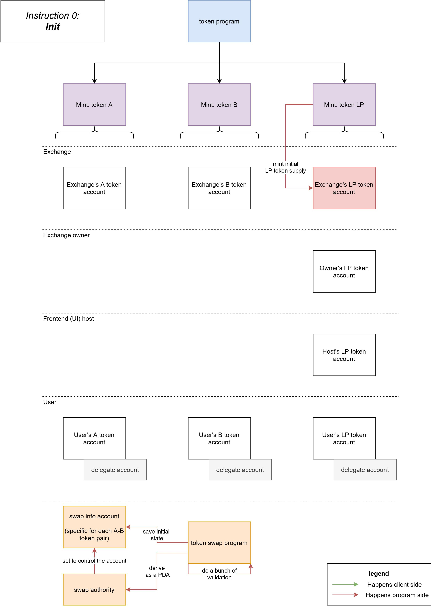
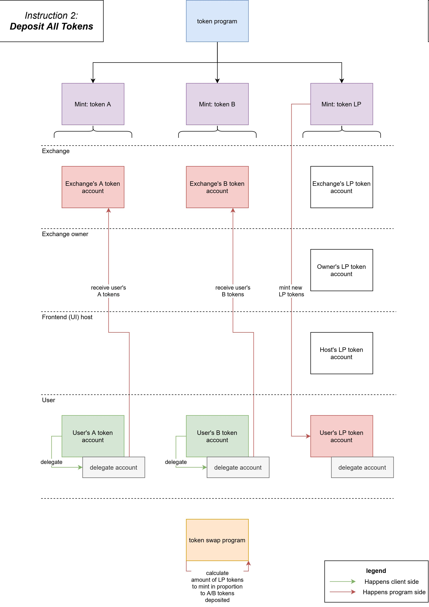
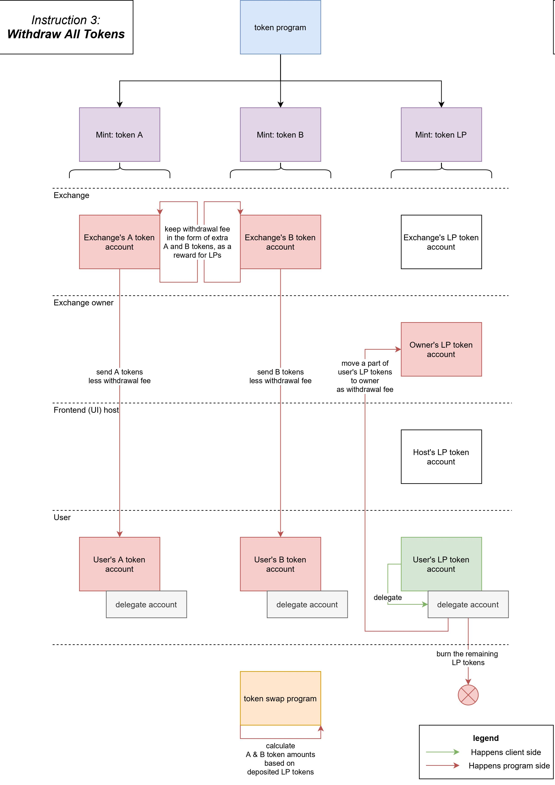
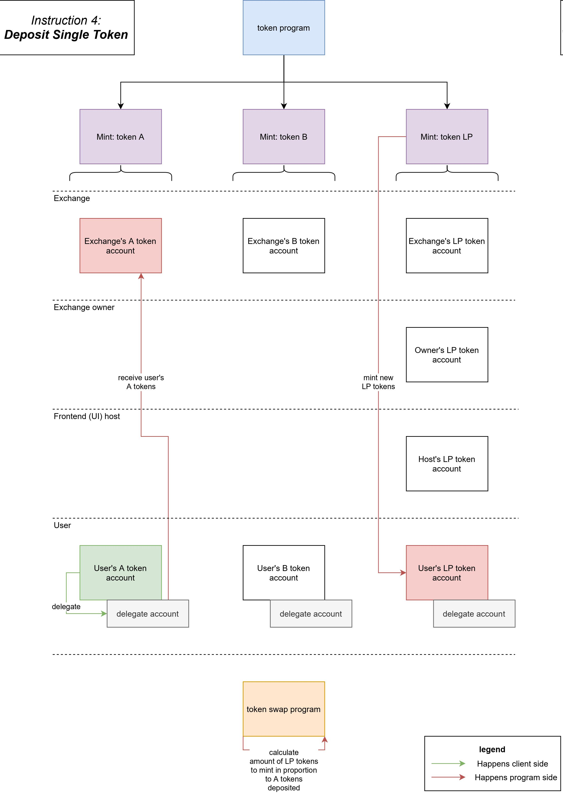

# Solana Token Swap Visualization

Simple diagrams to explain the 6 instructions of the [Solana Token Swap program](https://github.com/solana-labs/solana-program-library/tree/master/token-swap).

JPEGs below.

PDF and draw.io XML file in the repo.

