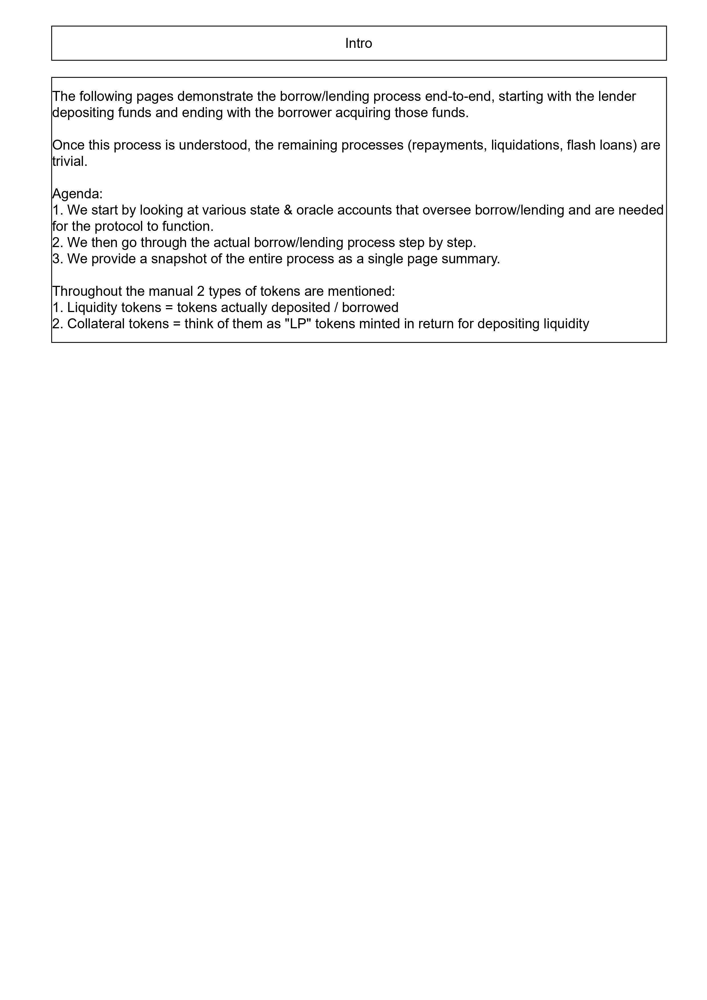
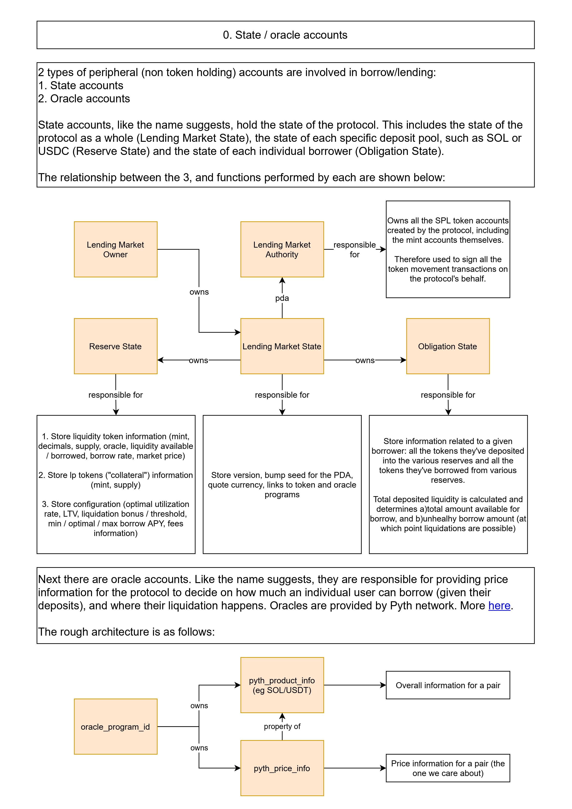
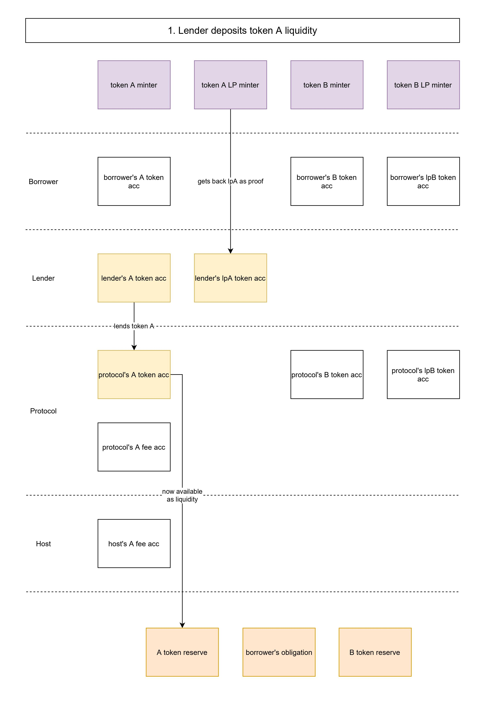
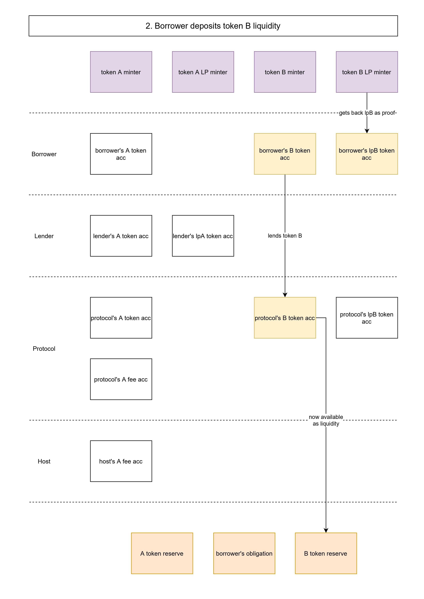
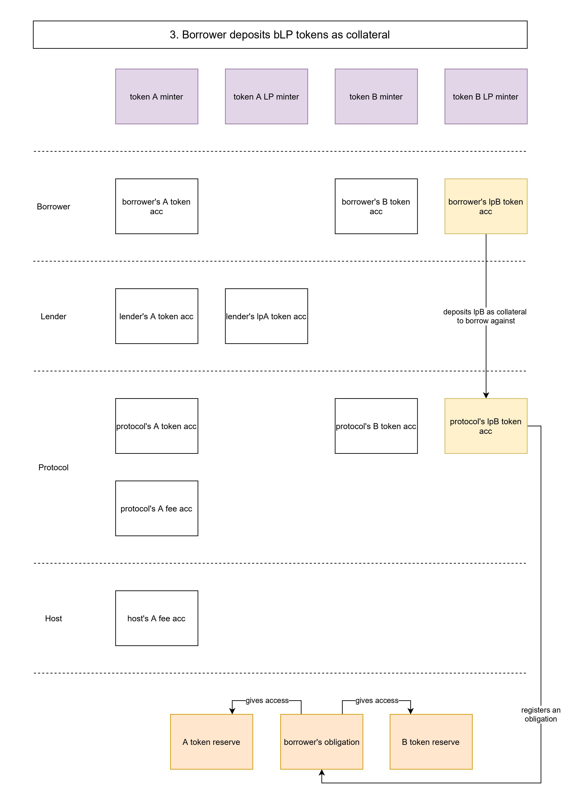
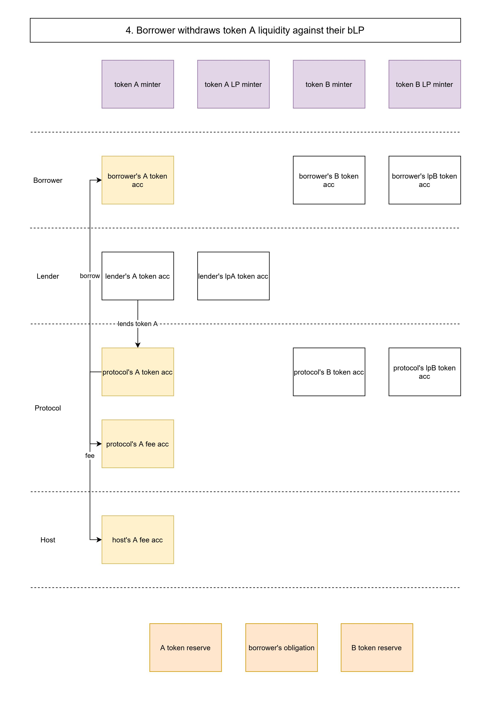
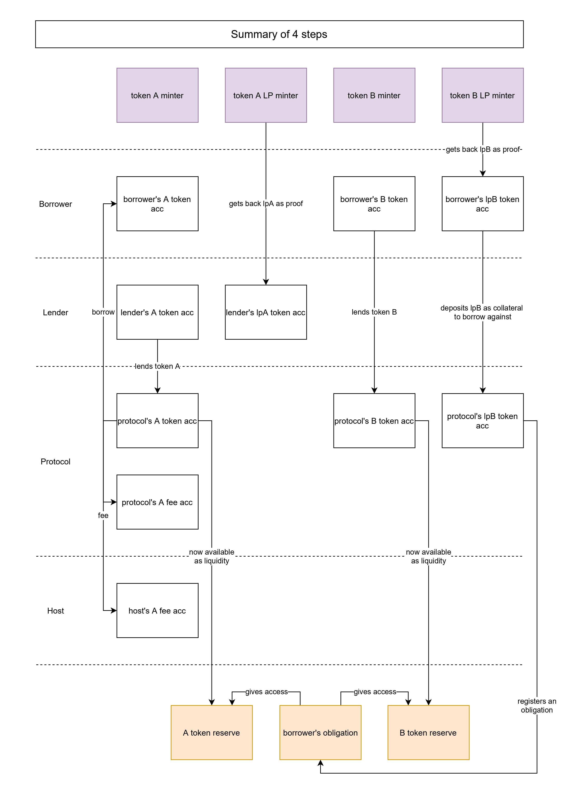

# SPL Token Lending

Simple diagrams to explain the borrow-lending process as done by [Solana Token Lending program](https://github.com/solana-labs/solana-program-library/tree/master/token-lending).

This doesn't cover all instructions, but provides key pieces of information needed to understand how everything works. Rest should be trivial.

JPEGs below, PDF and XML file in the dir.

